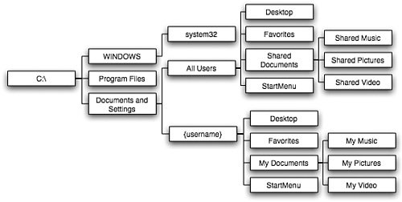

# File dan Direktori

## Mari Kita Memahami

### Apa itu File?

Kolekso data yang disimpan di hardisk dan dapat dimanipulasi sebagai unit tunggal dengan namanya.

### Apa itu Directory?

File yang berperan sebagai wadah untuk file lainnya.

Directory dapat berisi directory lain yang disebut sebagai **Subdirektori**.

Direcotry yang menampung directory lain disebut Directory Induk atau **Parent Directory**.

### Struktur Directory.

#### Windows

#### Linux

-----

### [Operasi File dan Direktori.](operasi-file-direktori.html)