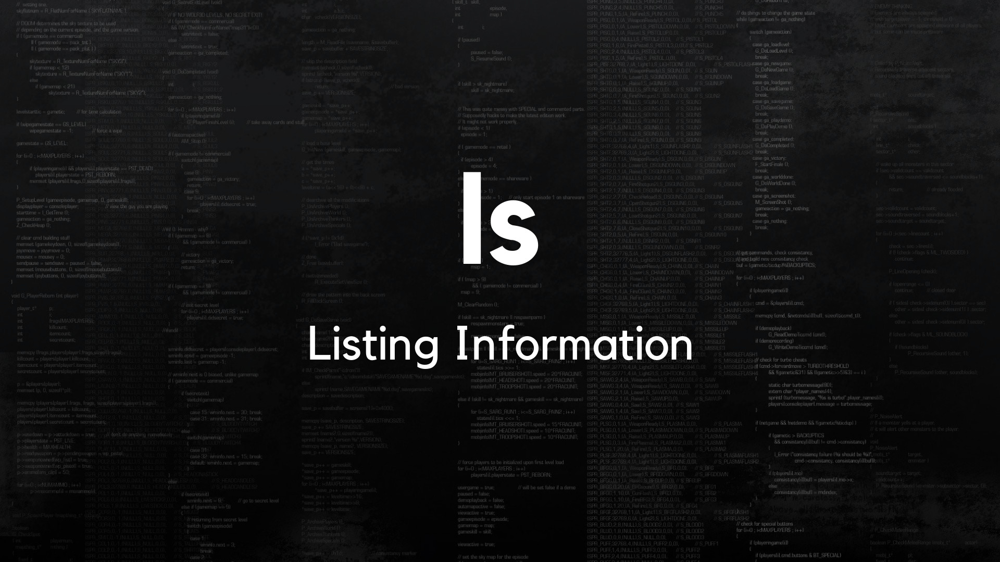
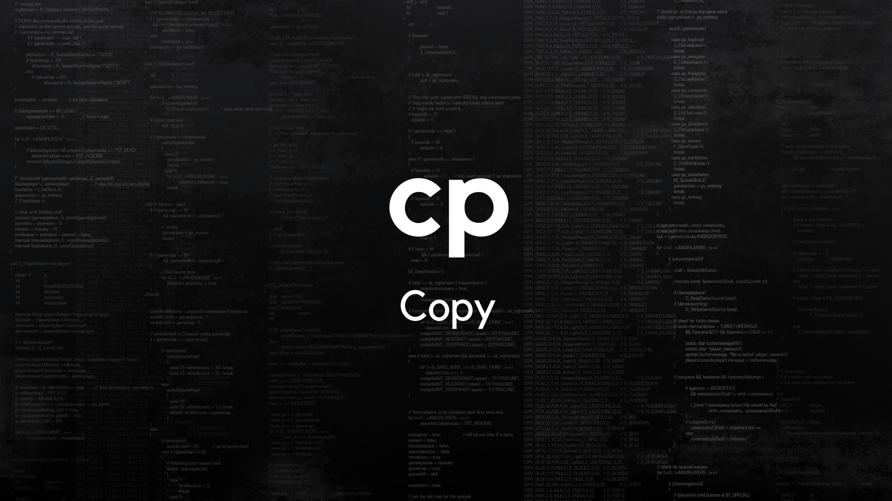
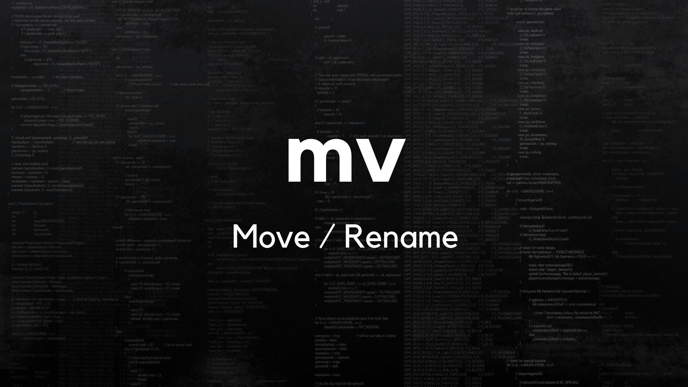
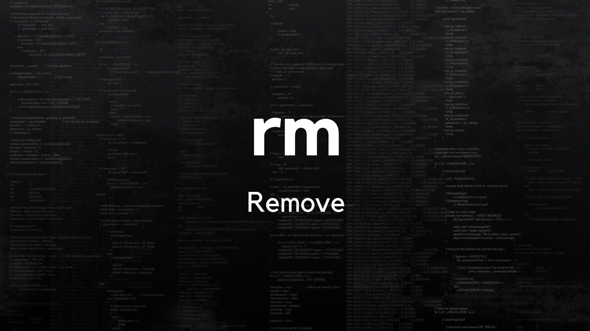

# Operasi File dan Direktori

## Operasi Direktori

### 1. Menampilkan Isi Direktori

`ls` adalah perintah untuk menampilkan isi direktori

1. `ls`
2. `ls -l`
3. `ls -la`
4. `ls -l /etc/`

### 2. Menampilkan Posisi Direktori Sekarang

`pwd` adalah perintah untuk menampilkan atau mengecek posisi direktori sekarang.

1. Buka Terminal: `ctrl + alt t`
2. Cek posisi: `pwd`
3. Melihat isi Direktori `ls`
4. Pindah ke Direktori Desktop `cd desktop`
5. Cek posisi `pwd`

### 3. Pindah Direktori

Path Absolute**: Path yang dimulai dari root (/)

**Path Relative**: Path yang dimulai dari posisi terakhir (current direktori).

#### Path Absolute:

1. Buka terminal: `ctrl + alt + t`
2. Pindah direktori Desktop: `cd /home/aufa18/Desktop`
3. Cek posisi: `pwd`
4. Pindah direktori Documents: `cd /home/aufa18/Documents`
5. Cek Posisi: `pwd`

#### Path Relative

1. buka terminal `ctrl + alt + t`
2. Pindah ke direktori Dekstop: `cd Desktop`
3. Cek posisi: `pwd`
4. Pindah direktori Documents`cd ../Documents`
5. Pindh direktori sebelumnya 1 kali: `cd ../`
6. Pindh direktori sebelumnya 2 kali: `cd ../../`

#### Note:

Perintah `cd` akan langsung diarahkan ke direktori home user (/home/namauser).

Ketika membuka terminal, maka posisi user langsung diarahkan ke direktori home user (/home/namauser).

### 4. Membuat Direktori

`mkdir` adalah perintah untuk membuat direktori.

1. Pindah direktoru Desktop: `cd Desktop`
2. Membuat folder Belajar: `mkdir Belajar`
3. Membuat folder data1/data2: `mkdir -p data1/data2`

## Operasi File / Direktori

### 1. Menyalin File/Direktori

`cp` adalah perintah untuk menyalin file atau direktori.

1. Membuat file tugas1: `touch tugas1`
2. Membuat folder posa1: `mkdir posa1`
3. Melihat isi Direktori: `ls -l`
4. Menyalin file tugas1 ke tugas22: `cp tugas1 tugas2`
5. Menyalin folder posa1 ke posa2: `cp -r posa1 posa2`

### 2. Mengganti atau Memindahkan Nama File / Direktori

`mv` adalah perintah yang digunakan untuk memindahkan file / direktori atau mengganti nama file / direktori.

1. Mengganti nama file tugas1 menjadi tugas2: `mv tugas1 tugas2`
2. Melihat isi Direktori: `ls`
3. Memindahkan file tugas2 ke folder posa1`mv tugas2 posa1`
4. Melihat isi Direktori: `ls`
5. Mengganti nama folder posa1 menjadi posa3: `mv posa1 posa3`
6. Melihat isi Direktori: `ls`
7. Memindahkan`mv folder3 folder2`

### 3. Menghapus File / Direktori

`rm` adalah perintah untuk menghapus file atau direktori

1. Menghapus file: `rm tugas1`
2. Melihat isi Direktori: `ls`
3. Menghapus folder posa2: `rm -r posa2`
4. Melihat isi Direktori: `ls`

## Selesai.